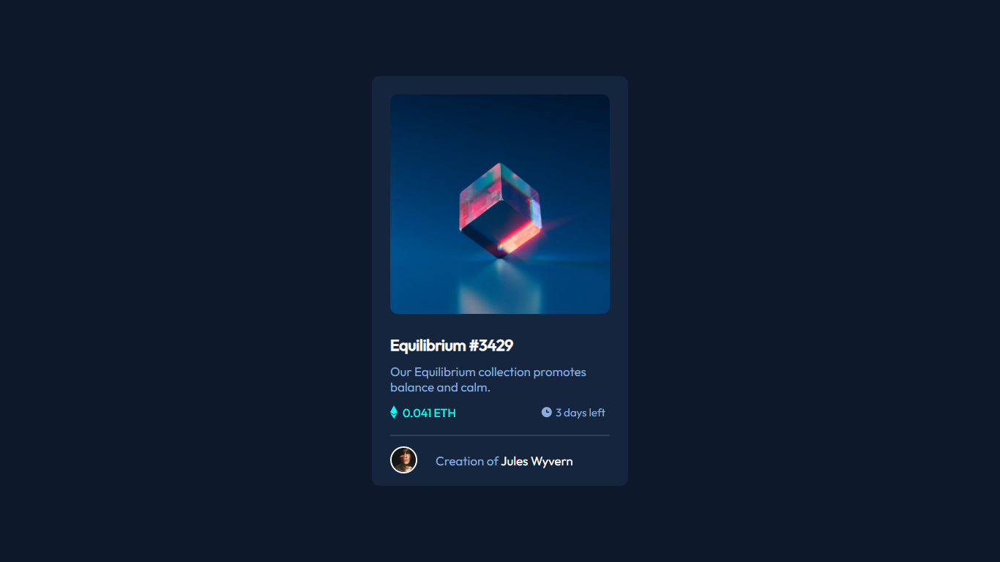

# Frontend Mentor - solução de componente de cartão de visualização NFT

Esta é uma solução para o [desafio do componente de cartão de visualização NFT no Frontend Mentor](https://www.frontendmentor.io/challenges/nft-preview-card-component-SbdUL_w0U). Os desafios do Frontend Mentor ajudam você a melhorar suas habilidades de codificação criando projetos realistas.

## Índice

- [Visão geral](#visão-geral)
  - [O desafio](#the-challenge)
  - [Captura de tela](#captura-de-tela)
  - [Links](#links)
- [Meu processo](#meu-processo)
  - [Construído com](#construído-com)
  - [O que aprendi](#o-que-aprendi)
  - [Desenvolvimento contínuo](#desenvolvimento-contínuo)
  - [Recursos úteis](#useful-resources)
- [Autor](#autor)
- [Agradecimentos](#agradecimentos)

## Visão geral

### O desafio

Os usuários devem ser capazes de:

- Visualize o layout ideal dependendo do tamanho da tela do dispositivo
- Veja os estados de foco para elementos interativos

### Captura de tela



### Links

- URL da solução: [Site da solução](https://your-solution-url.com)
- URL do site ao vivo: [Site ao vivo](https://your-live-site-url.com)

## Meu processo

### Construído com

- Marcação HTML5 semântica
- Propriedades personalizadas de CSS
- Flexbox

### O que eu aprendi

Neste projeto foi melhorado as habilidades de css, tendo ênfase na propriedade flex.


``` css
body{
    min-height: 100vh;
    min-width: 100vw;
    display: flex;
    justify-content: center;
    align-items: center;
    background-color:hsl(217, 54%, 11%);
    font-family: 'Outfit', sans-serif;
}
```

### Desenvolvimento contínuo

Para desenvolvimento contínuo pretendo continuar aperfeiçoando meus conhecimentos em css e começar a estudar JavaScript.

### Recursos úteis

- [Converter cores](https://convertingcolors.com/) - Isso me ajudou a converter as cores. Gostei muito deste modelo e vou usá-lo daqui para frente.
- [Estilizar Tag <hr>](https://www.devmedia.com.br/forum/como-mudar-a-cor-da-tag-hr/573648) - Este é um artigo incrível que me ajudou a entender como estilizar a tag hr. Eu recomendo para quem ainda está aprendendo este conceito.

## Autor

- Site - [Henrique Silva](https://profilehs.netlify.app/)
- Mentor de frontend - [@byhenriquesilva](https://www.frontendmentor.io/profile/byhenriquesilva)
- Github - [@byhenriquesilva](https://github.com/byhenriquesilva)

## Agradecimentos

Agradecer primeiramente a Deus, agradecer a Frontend Mentor por essa oportunidade de praticar e melhorar minnhas habilidades e agradecer a todos que me ejudaram e me apoiaram na construção desse projeto.